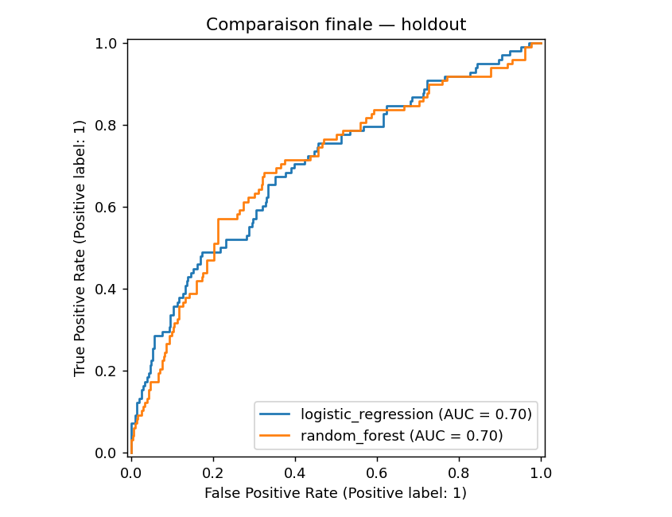
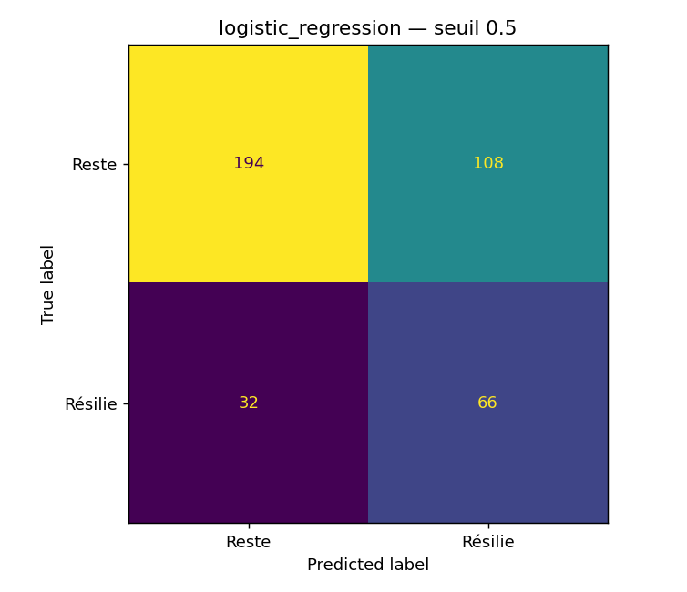
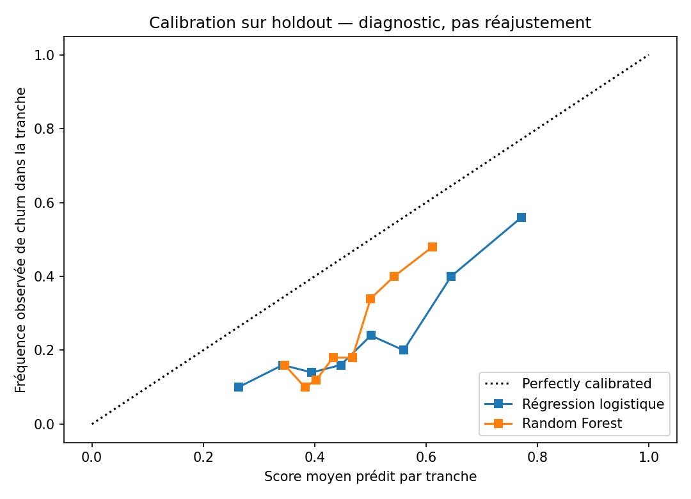
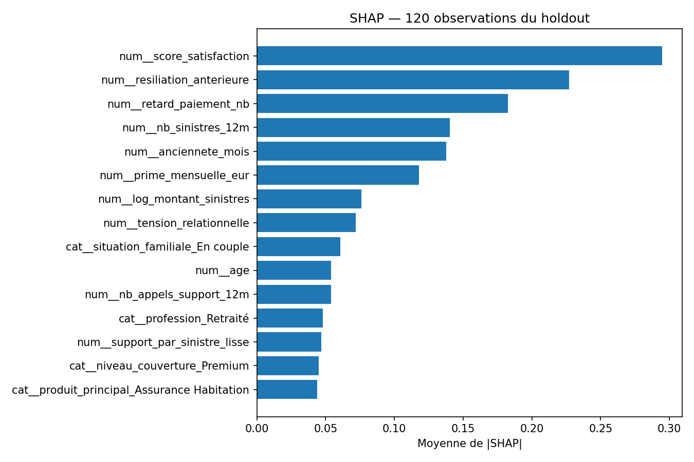
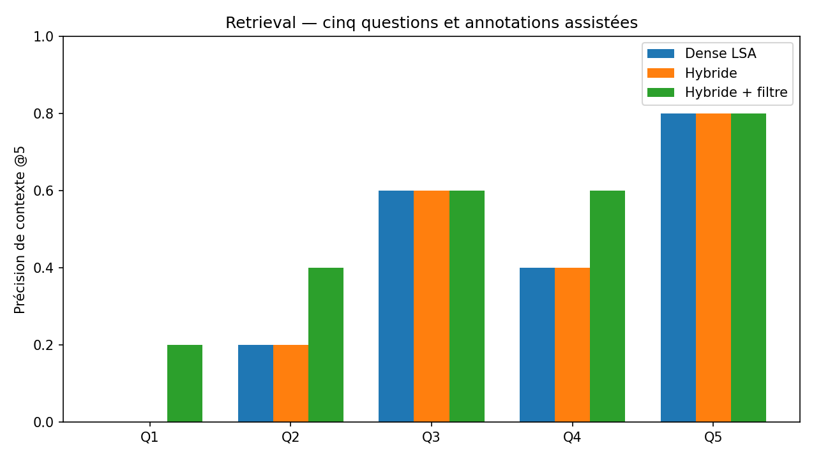

# Test technique IA — Assurance

**Prédiction du churn · Recherche documentaire RAG · API FastAPI**

Implémentation du [sujet Periclès Group](docs/SUJET_ORIGINAL.md), à partir du CSV et des vingt PDF fournis. Le modèle entraîné, l'index, les sorties d'expériences et les données sont inclus. Aucun téléchargement de modèle n'est nécessaire pour lancer l'API de churn.

> **État réel de cette livraison.** Le ML, le retrieval, les métriques documentaires et l'API HTTP ont été exécutés. Les réponses RAG jointes sont un lot produit par ChatGPT dans la conversation, puis importé avec provenance et empreinte du prompt : **ce n'est pas une exécution autonome d'Ollama**. L'adaptateur Ollama est implémenté et son contrat HTTP testé avec une fixture ; son appel à un vrai modèle reste à exécuter. Le Dockerfile est fourni, mais **Docker était absent de l'environnement de réalisation**. L'accès GitHub a échoué en lecture et écriture ; aucun push n'est annoncé.

## Résultats en un regard

| Élément | Résultat observé | Preuve |
|---|---|---|
| Données ML | 2 000 clients, 20 colonnes, 492 churners (24,6 %) | [Audit](partie1_ml/outputs/dataset_audit.json) |
| Séparation | 1 600 clients train / 400 test, stratification, graine 42 | [Partitions](partie1_ml/outputs/split_manifest.json) |
| Modèle retenu | Régression logistique, sélection par AP moyenne en CV | [Comparaison](partie1_ml/outputs/metrics.json) |
| Holdout | AUC 0,6994 ; précision 0,3793 ; rappel 0,6735 ; F1 0,4853 | [Métadonnées](partie1_ml/metadata.json) |
| Corpus RAG | 20 PDF, 36 pages, 110 chunks, vecteurs LSA de dimension 64 | [Manifeste](partie2_rag/index/manifest.json) |
| Précision de contexte moyenne | Dense 0,40 ; hybride 0,40 ; hybride filtré 0,52 | [Résultats](partie2_rag/results.json) |
| API | Vrai HTTP : health 200, predict 200, requête invalide 422 | [Smoke HTTP](docs/evidence/http_smoke.json) |
| Docker / LLM local / GitHub | Vérifications externes bloquées ou non exécutées | [État de vérification](docs/VERIFICATION.md) |

Les scores ne doivent pas être surinterprétés : le modèle pondéré **n'est pas calibré**, le holdout ne compte que 98 churners et le benchmark documentaire seulement cinq questions connues.

## Comment lancer l'API

Toutes les commandes ci-dessous partent de la racine du dossier extrait. Deux chemins sont possibles.

### Avec Python, sans Docker et sans LLM

Environnement effectivement testé : **Python 3.13.5**, Linux CPU. Pour se rapprocher au maximum des artefacts, utiliser Python 3.13. Les versions Python sont enregistrées dans les métadonnées ; une différence de version scikit-learn provoque volontairement une indisponibilité plutôt qu'un chargement silencieux.

**Windows PowerShell :**

```powershell
py -3.13 -m venv .venv
.\.venv\Scripts\python.exe -m pip install -r requirements-api.txt
.\.venv\Scripts\python.exe -m uvicorn partie3_mlops.app:app --host 127.0.0.1 --port 8000 --workers 1
```

**Linux / macOS :**

```bash
python3.13 -m venv .venv
.venv/bin/python -m pip install -r requirements-api.txt
.venv/bin/python -m uvicorn partie3_mlops.app:app --host 127.0.0.1 --port 8000 --workers 1
```

Dans un second terminal, **PowerShell** :

```powershell
Invoke-RestMethod http://127.0.0.1:8000/health
$body = Get-Content -Raw -Encoding UTF8 partie3_mlops/example_request.json
Invoke-RestMethod -Uri http://127.0.0.1:8000/predict -Method Post -ContentType 'application/json; charset=utf-8' -Body ([System.Text.Encoding]::UTF8.GetBytes($body))
```

Ou **Bash** :

```bash
curl --fail http://127.0.0.1:8000/health
curl --fail -X POST http://127.0.0.1:8000/predict \
  -H 'Content-Type: application/json' \
  --data-binary @partie3_mlops/example_request.json
```

Sous PowerShell, utiliser `curl.exe` pour appeler le véritable exécutable curl plutôt qu’un alias PowerShell. Le fichier d'exemple est complet, synthétique et indépendant des clients du CSV. Sa réponse réellement mesurée est :

```json
{
  "client_id": "DEMO-001",
  "churn_probability": 0.4663275906686875,
  "prediction": 0,
  "risk_level": "modéré"
}
```

La documentation interactive est à `http://127.0.0.1:8000/docs` et le schéma à `/openapi.json`. Le champ `churn_probability` est un **score de modèle non calibré**, malgré son nom imposé par le sujet.

### Avec Docker

```bash
docker build -t churn-api .
docker run --rm -p 8000:8000 churn-api
```

Le modèle réel, ses transformations importables et ses métadonnées sont copiés dans l'image. Aucun CSV, PDF, GPU, clé ou montage de modèle n'est requis. Le build initial télécharge les dépendances ; la prédiction ne dépend ensuite d'aucun réseau. Le port est ici publié comme dans le sujet ; pour un usage strictement local, préférer `-p 127.0.0.1:8000:8000`.

Un volume de logs est proposé en option :

```bash
docker compose -f partie3_mlops/docker-compose.yml up --build
```

Le Dockerfile de `partie3_mlops/` est une copie vérifiée de celui de la racine. Le contexte de build reste la racine. Le script suivant effectue réellement le build, démarre un conteneur, teste les réponses et supprime uniquement son propre conteneur :

```bash
python -m scripts.smoke_docker
```

**Cette commande n'a pas pu être validée ici : Docker est absent.** Elle retourne un code non nul si Docker manque ou si la vérification échoue. Ne pas confondre le smoke HTTP Python réussi et une validation de l'image.

## Partie 1 — ML, décisions et limites

### Préparation et prévention des fuites

Les contrôles de schéma sont effectués sur le fichier ; les décisions statistiques et l'exploration guidant la modélisation utilisent uniquement le train. Le holdout stratifié est réservé avant l'imputation et le tuning. `client_id` sert à vérifier la séparation, jamais à prédire. `churned` est explicitement refusé par le transformeur.

Les 77 valeurs manquantes de satisfaction et 85 d'appels support deviennent respectivement 64 et 66 valeurs manquantes dans le train. Les médianes et indicateurs de manque sont appris **dans chaque fold**, avec l'encodage et la normalisation. Une catégorie inédite est acceptée et ignorée par le one-hot, sans inventer une catégorie entraînée.

Le seuil supérieur IQR des sinistres sur train est 4 693,33 €, avec 120 valeurs au-dessus et un maximum de 39 404,53 €. Ces montants élevés ne sont pas automatiquement des erreurs : ils sont conservés et traités par `log1p`. Aucun dossier n'est supprimé pour améliorer les scores.

Trois features métier sont ajoutées :

| Feature | Formule | Intuition et limites |
|---|---|---|
| `support_par_sinistre_lisse` | appels 12 mois / (1 + sinistres 12 mois) | Sollicitations relativement aux sinistres ; lissage évitant une division par zéro, pas un coût moyen. |
| `tension_relationnelle` | (5 − satisfaction) × appels 12 mois | Interaction entre insatisfaction et fréquence de contact ; une donnée manquante reste manquante avant imputation. |
| `retards_x_resiliation` | retards × résiliation antérieure | Cumul de difficultés contractuelles ; proxy associatif, non score de risque validé. |

`log_montant_sinistres` complète ces features comme transformation de distribution. Le montant total n'est pas divisé par le nombre annuel de sinistres : leurs horizons ne sont pas définis de façon identique. Aucune « rentabilité actuarielle » n'est fabriquée.

La date d'observation n'est pas fournie. Les dates de souscription et de dernière interaction sont donc écartées des predictors : aucune récence calculée à partir de la date actuelle, aucune prétendue validation temporelle. L'ancienneté déclarée est conservée comme telle. La disponibilité des variables avant l'horizon cible de trois mois doit être confirmée avant usage réel.

### Comparaison finale

Les deux modèles utilisent `class_weight="balanced"`. Le tuning utilise cinq folds stratifiés et le même train. La régression logistique explore cinq valeurs de C ; la forêt huit combinaisons avec 180 arbres. Le meilleur modèle est choisi par **Average Precision moyenne en CV**, avant de calculer les scores holdout. Le seuil 0,5 est fixé à l'avance, sans optimisation sur le test.

| Modèle | AP CV moyenne ± écart-type | AUC test | AP test | Précision | Rappel | F1 | Brier ↓ |
|---|---:|---:|---:|---:|---:|---:|---:|
| Régression logistique retenue | 0,4050 ± 0,0425 | 0,6994 | 0,4835 | 0,3793 | 0,6735 | 0,4853 | 0,2268 |
| Random Forest | 0,3780 ± 0,0184 | 0,6976 | 0,4475 | 0,4480 | 0,5714 | 0,5022 | 0,2164 |
| Dummy, fréquence du train | — | 0,5000 | 0,2450 | 0 | 0 | 0 | 0,1850 |

La forêt obtient un meilleur F1 sur le holdout, mais cela ne justifie pas de changer après coup le critère de sélection. La régression capture **66 des 98 churners**, manque 32 churners et produit **108 faux positifs**. Les 194 autres clients sont correctement classés non-churners. Aucun coût de campagne ou retour sur investissement n'a été fourni.





L'intervalle bootstrap percentile à 95 % de l'AUC, calculé sur 500 rééchantillonnages du holdout avec modèle fixé, est environ **0,640–0,762**. Il ne mesure pas toutes les incertitudes de choix de modèle. Le Brier des modèles pondérés est plus mauvais que celui de la référence constante : **les scores ne doivent pas être traités comme des probabilités métier calibrées**. Une calibration et un seuil fondés sur les coûts sont des travaux ultérieurs, avec validation séparée.



### Interprétabilité

SHAP a réellement été calculé sur 120 observations du holdout, avec 100 observations de fond provenant du train. Pour la régression, les contributions sont en log-odds. Les cinq premières variables, par moyenne absolue SHAP, sont la satisfaction, la résiliation antérieure, les retards de paiement, les sinistres sur douze mois et l'ancienneté.

Les coefficients du modèle retenu sont négatifs pour la satisfaction et l'ancienneté, positifs pour les trois autres. Cela est compatible avec une interprétation de fidélité et de tensions contractuelles, mais **ne prouve aucune causalité**. Les interactions et corrélations répartissent les contributions ; aucune amélioration isolée du feature engineering n'est affirmée sans ablation.



Une importance par permutation complète cette lecture. Les métriques, paramètres, partitions et importances sont dans `partie1_ml/outputs/`. Le [notebook exécuté](partie1_ml/notebook.ipynb) présente les résultats ; le [script d'entraînement](partie1_ml/train.py) les reproduit.

## Partie 2 — RAG et évaluation documentaire

### Ce qui fonctionne sans réseau

Les 20 PDF sont extraits avec pypdf, page par page, en conservant les titres et les cellules de tableau dans l'ordre logique du texte. Les sections continuant sur la page suivante restent assemblées : c'est essentiel pour la réponse de la FAQ Multirisque Pro qui commence en page 2 après une question en page 1. Les pages et tableaux probants ont également été contrôlés visuellement.

Le chunking respecte les sections, sans mélange de documents. La limite est de **240 mots séparés par espaces**, avec 40 mots d'overlap seulement lorsqu'une section dépasse cette taille. Ce ne sont pas des tokens neuronaux. Ici, les 110 chunks mesurent de 10 à 136 mots (médiane 50,5) : aucune section n'a nécessité un découpage supplémentaire. Les métadonnées conservent source, pages, gamme, formule, section, identifiants et empreintes.

Faute de réseau et de poids préentraînés dans le runtime, les embeddings sont **LSA : TF-IDF de mots/unigrammes-bigrammes, SVD de rang 64, normalisation L2**. La vector store persiste les vecteurs NumPy, l'encodeur et les chunks ; la recherche est exacte par produit scalaire/cosinus. **Ce n'est ni E5, ni un modèle neuronal, ni FAISS.** Ce choix permet une exécution effective, déterministe et légère sur ce petit corpus, mais sa sémantique hors vocabulaire est limitée.

Trois variantes sont comparées sur les mêmes questions, corpus, chunks et vecteurs : dense seule ; dense + BM25 fusionnés par RRF ; puis cette recherche hybride avec filtre de gamme/formule explicite, conservant les FAQ. La constante RRF vaut 60 ; les vingt premiers candidats de chaque moteur sont fusionnés avant sélection du top 5. Les règles ne contiennent pas d'identifiant Q1–Q5 ni de réponse hardcodée.

### Mesures réellement calculées

`context_precision` désigne ici **Precision@5**, proportion des passages retournés jugés pertinents selon la grille jointe ; ce n'est pas la formule RAGAs. Une variante sensible au rang et le rappel des chunks probants sont fournis séparément. Les annotations contiennent les passages et raisons, ont été préparées avant le calcul des scores et sont marquées **revue assistée par ChatGPT, non validée humainement**. Elles restent discutables et ne sont pas une vérité indépendante.

| Question | Dense P@5 | Hybride P@5 | Hybride + filtre P@5 | Commentaire |
|---|---:|---:|---:|---|
| Q1 — Garanties Habitation Confort | 0,00 | 0,00 | 0,20 | Les tarifs dominent le baseline. Le filtre fait entrer le tableau des garanties, mais seulement au rang 4. |
| Q2 — Carence Santé Essentiel | 0,20 | 0,20 | 0,40 | La carence n'est pas le délai de remboursement. Le filtre retrouve aussi le cas distinct de portabilité. |
| Q3 — Résiliation Multirisque Pro | 0,60 | 0,60 | 0,60 | Les sources principales sont présentes, mais la clause break Premium n'entre pas dans le top 5. |
| Q4 — Bris de glace Auto Premium | 0,40 | 0,40 | 0,60 | La clause « 0 € — 1 sinistre/an » est retrouvée ; le filtre retire d'autres formules et ajoute le cas CRM. |
| Q5 — Activités à risque, Vie | 0,80 | 0,80 | 0,80 | Les exclusions des trois niveaux et la FAQ sont toutes retrouvées. |
| **Moyenne** | **0,40** | **0,40** | **0,52** | **+0,12 absolu** pour la variante complète contre le baseline. |



L'hybride seul n'améliore pas P@5 ; son léger gain porte sur la qualité du classement (0,6000 → 0,6333). Avec le filtre, cette métrique atteint 0,6944 et le rappel moyen des preuves passe de 0,5833 à 0,8167. Ces cinq questions sont connues et ont servi à réfléchir à l'architecture : la comparaison est **exploratoire**, pas une mesure de généralisation.

Deux pistes sont implémentées et mesurées : recherche hybride et filtrage de métadonnées. Une troisième piste serait un reranker multilingue évalué sur un jeu indépendant, notamment pour remonter les clauses de garantie plutôt que les tarifs et récupérer les dispositions particulières Premium. Les performances de cette piste ne sont pas inventées.

### Réponses et provenance

[results.json](partie2_rag/results.json) et [son export lisible](partie2_rag/results.md) contiennent les quinze runs : cinq questions × trois variantes, chunks complets, cosinus/BM25/RRF distincts, messages construits, empreinte du prompt, réponse et métriques.

Les réponses jointes sont produites par **ChatGPT dans la conversation**, après ouverture des prompts et contextes exportés, puis réimportées comme `chatgpt_interactive_batch`. Elles ne sont pas générées par le script à partir d'une table de réponses. Le runtime n'utilise jamais ces réponses préécrites pour une question libre. Leur orchestration est manuelle ; la même session a aussi vu le corpus complet et les annotations. **Elles ne prouvent donc ni un backend autonome fonctionnel, ni une évaluation aveugle de fidélité.** Aucun score de faithfulness, temps de génération ou seed serveur n'est attribué à ce lot.

Le fichier [results_retrieval.json](partie2_rag/results_retrieval.json) conserve l'état antérieur sans génération, avec `answer: null`. Le client Ollama natif est implémenté ; un essai réel a échoué parce que le service local n'est pas présent. Une fixture HTTP vérifie le format d'appel, pas la qualité d'un vrai modèle.

### Relancer le pipeline

Après installation de l'environnement complet (`python -m pip install -r requirements.txt`) :

```bash
python -m partie2_rag.pipeline ingest
python -m partie2_rag.pipeline ask "Quelle est la franchise bris de glace Auto Premium ?" --contexts-only
python -m partie2_rag.pipeline benchmark --generation none --output partie2_rag/results_retrieval_rerun.json
```

Pour la génération autonome, installer et démarrer Ollama sur la machine cible, puis télécharger le modèle choisi. Aucune clé payante n'est nécessaire pour cette option locale ; les poids ne sont pas inclus dans le ZIP.

```bash
ollama pull qwen2.5:1.5b
# ollama serve   # uniquement si le service n'est pas déjà démarré
python -m partie2_rag.pipeline ask "Quels sont les délais de carence Santé Essentiel ?" --model qwen2.5:1.5b
python -m partie2_rag.pipeline chat --model qwen2.5:1.5b
python -m partie2_rag.pipeline benchmark --generation ollama --model qwen2.5:1.5b --output partie2_rag/results_ollama.json
```

`--ollama-url`, `--timeout`, `--top-k` et `--mode` sont disponibles. Les erreurs réseau ou de modèle donnent un statut d'échec et un code non nul : elles ne deviennent jamais une fausse abstention documentaire. Le mode conversation conserve au plus quatre messages d'historique ; il utilise la question précédente pour clarifier une relance, sans traiter une ancienne réponse comme source.

Pour reproduire uniquement l'import du lot fourni, **sans prétendre rappeler un LLM** :

```bash
python -m partie2_rag.pipeline import-batch --retrieval partie2_rag/results_retrieval.json --batch partie2_rag/chatgpt_batch_answers.json --output partie2_rag/results_batch_reimport.json
```

### Points documentaires à ne pas effacer

Q3 distingue « avant une échéance ultérieure » et « avant la toute première échéance ». Les textes n'autorisent pas à inventer une dérogation générale pendant la première année. La FAQ donne un préavis d'un mois en Premium ; la fiche Premium mentionne une **clause break pour sinistralité exceptionnelle avec trois mois de préavis**. Les portées ne sont pas clairement articulées : ne pas fusionner ces dispositions en une règle unique. Cette dernière clause manque dans les contextes top 5 ; c'est une limite réelle, pas une correction à injecter en cachette dans la réponse.

Q4 ne doit pas perdre la limite d'un sinistre/an à franchise nulle. Le montant au-delà de cette limite n'est pas précisé. Q5 renvoie à une liste et une annexe non fournies : les exemples ne deviennent pas une liste exhaustive. Les informations juridiques éventuellement écrites dans les PDF sont restituées comme contenu du test 2024, **non comme état actuel du droit**.

## Partie 3 — Contrat API, logs et surveillance

Le contrat brut contient les champs du CSV hors cible. `client_id` est renvoyé mais non appris ; les dates sont optionnelles et non prédictives. Satisfaction et appels support sont facultatifs et peuvent être `null`. Les autres champs sont requis. Types numériques, finitude, domaines, dates ISO et chronologie sont validés ; les chaînes numériques, booléens numériques et champs supplémentaires comme `churned` sont refusés. Les modalités catégorielles inconnues suivent la règle d'encodage documentée.

Le modèle est chargé une fois au démarrage, avec vérification SHA-256 et version scikit-learn. Une absence ou corruption produit `/health` et `/predict` en 503. Les entrées invalides donnent 422 sans réafficher le payload brut. Le seuil est 0,5 ; « faible » signifie p < 0,25, « modéré » 0,25 ≤ p < 0,5, « élevé » p ≥ 0,5. Ces bornes sont **illustratives**, cohérentes avec `prediction`, pas validées commercialement.

Chaque prédiction réussie produit une ligne JSON dans `logs/predictions.jsonl` : horodatage UTC, request_id, version, variables validées, sortie, seuil et durée. L'identifiant client et les dates sont retirés. Cela minimise les données, sans rendre automatiquement anonymes les autres caractéristiques. Rotation : 5 Mo et trois sauvegardes, un worker recommandé ; les threads du même processus utilisent le verrou du handler. Le volume Compose permet de conserver les logs après suppression du conteneur.

**Deux indicateurs prioritaires :** le PSI de `montant_sinistres_eur`, comparé aux classes fixées sur le train (incluant le manque), et le rappel des churners une fois les labels à trois mois matures et rapprochés de façon contrôlée. Le premier aide à détecter un changement d'exposition, par exemple davantage de gros sinistres ; le second mesure les churners réellement manqués. Les entrées et scores seuls ne donnent pas ce rappel. Aucun seuil d'alerte ni coût de rétention n'est validé ici.

Le script calcule les PSI, taux de scores élevés et p95 de latence à partir de la fenêtre de logs fournie ; `observed_recall` reste `null` sans labels :

```bash
python -m partie3_mlops.monitoring --logs logs/predictions.jsonl --output monitoring.json
```

Une production réelle nécessiterait également TLS, authentification, politique de rétention et d'accès, supervision de l'espace disque, contrôle des usages et revue de l'équité des variables. Ne pas exposer ce démonstrateur tel quel à Internet.

## Reproduction complète et tests

Dans les commandes suivantes, `python` désigne l’interpréteur du projet : `.\.venv\Scripts\python.exe` sous Windows ou `.venv/bin/python` sous Linux si l’environnement n’est pas activé. Aucune modification de la politique PowerShell n’est nécessaire.

Dans l'environnement virtuel, installer `requirements.txt` pour l'entraînement, l'analyse SHAP, le RAG, les notebooks et les tests. `requirements-api.txt` suffit à servir le modèle livré. Les versions installées ont été vérifiées entre elles ; une installation fraîche depuis Internet et l'exécution sous Windows n'ont pas pu être contrôlées dans ce runtime.

```bash
python -m pip install -r requirements.txt
python -m pytest -q
python -m scripts.smoke_api
python -m partie1_ml.train
python -m partie2_rag.pipeline ingest
python -m partie2_rag.pipeline benchmark --generation none --output partie2_rag/results_retrieval_rerun.json
```

Le script d'entraînement remplace les artefacts ML après une reproduction complète sur le même split, sans réentraîner sur le holdout. Les horodatages et durées peuvent changer ; les métriques doivent rester proches avec les mêmes versions. Le notebook peut être régénéré/exécuté par `python -m scripts.build_notebook`.

La suite couvre les entrées FastAPI, preprocessing, frontières de seuils, sérialisation, identité API/pipeline, séparation des clients, médianes train, intégrité de l'index, chunking inter-pages, BM25/RRF, annotations, métriques, provenance du batch et logs. La CI GitHub prévue relance tests, vrai HTTP et Docker ; **aucune exécution CI distante n'a eu lieu**.

## Organisation du dépôt

```text
README.md
requirements.txt / requirements-api.txt
Dockerfile / .dockerignore / .github/workflows/ci.yml
data/                       CSV original et 20 PDF
partie1_ml/                 features, entraînement, modèle, métadonnées, notebook, sorties
partie2_rag/                ingestion, retrieval, génération, évaluation, CLI, index, résultats
partie3_mlops/              API, schémas, monitoring, Docker/Compose, tests API
scripts/                    smoke HTTP/Docker, notebook, aide de publication
tests/                     tests transversaux et RAG
docs/                       sujet, plan, vérification, débrief, figures et preuves
```



